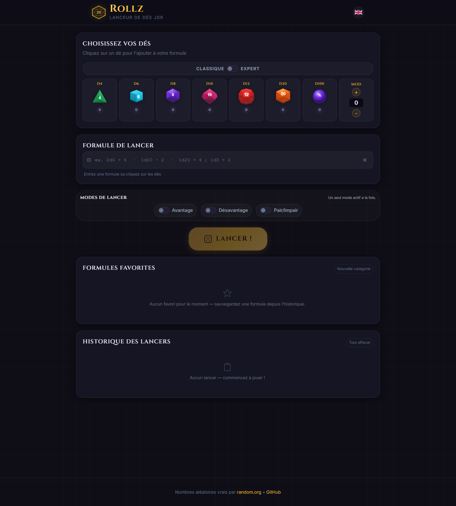
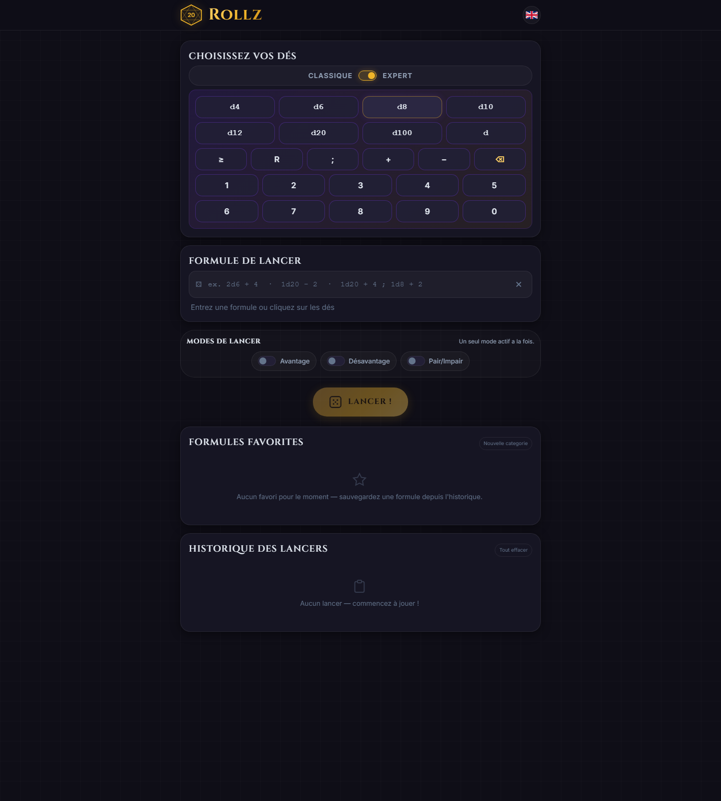
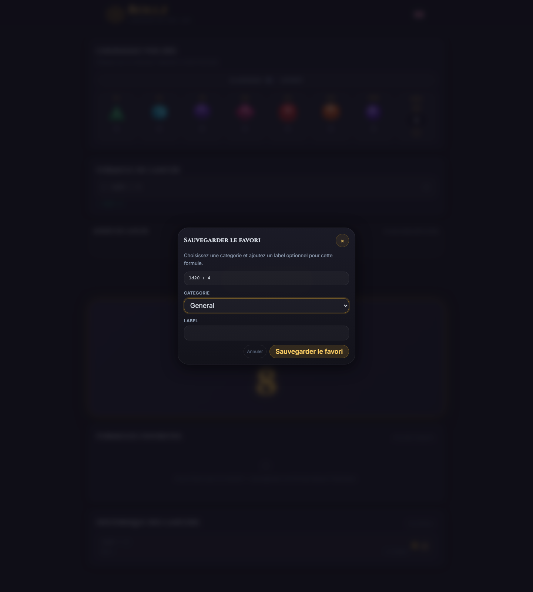
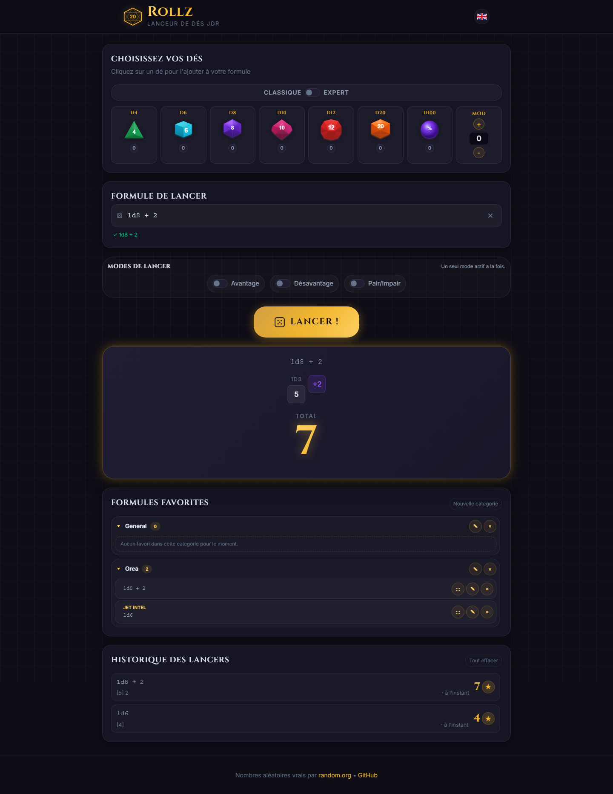

# Rollz

[](https://virlez.github.io/rollz/) [](https://web.dev/progressive-web-apps/) [](https://www.random.org/) [](https://developer.mozilla.org/en-US/docs/Web/JavaScript) [](https://playwright.dev/) [](https://www.typescriptlang.org/) [](#english)

<a id="english"></a>

## English

Rollz is a dark-fantasy styled TTRPG dice roller built with plain HTML, CSS, and JavaScript, using `random.org` for number generation.

User guide in English: [docs/WIKI_USER_GUIDE.md](docs/WIKI_USER_GUIDE.md)

User guide in French: [docs/WIKI_UTILISATEUR.md](docs/WIKI_UTILISATEUR.md)

### Screenshots

Home and classic builder:



Expert builder:



Favorite save modal:



History and categorized favorites:



### Features

- Classic dice formulas such as `2d6 + 4`, `1d20 - 2`, `3d8 + 1d4 + 5`
- Advanced inline formulas such as `8d6>=5`, `2d6R2`, `4d6R2>=5`
- Interactive visual dice: `d4`, `d6`, `d8`, `d10`, `d12`, `d20`, `d100`
- Two formula-building interfaces: `Classic` mode for quick dice selection and `Expert` mode for advanced operators in one compact panel
- `Advantage` / `Disadvantage` mode
- `Success Mode`:
	- only even results count as successes
	- only the first dice group is used
	- flat modifiers are added to the total
	- one bonus reroll if all initial dice are even
	- critical failure if all initial dice are odd
- French / English interface
- Roll history
- Responsive layout for desktop and mobile
- Easy GitHub Pages deployment

### Success Mode Rules

- Each even die counts as `1` success
- Each odd die counts as `0`
- Any dice group after the first one is ignored
- Flat modifiers (`+1`, `+2`, etc.) are added, except on critical failure
- If every die in the first roll is even, the group is rerolled once and the extra successes are added
- If every die in the first roll is odd, the final result is `0` with the message `Fumble`

### Advanced Formula Rules

Rollz supports two advanced inline operators that can be written directly after a dice group.

#### Success threshold: `NdX>=T`

- Example: `8d6>=5`
- Rolls `8` dice with `6` sides
- Counts `1` success for each final die result greater than or equal to `5`
- The displayed total becomes the number of successes
- Flat modifiers still apply: `8d6>=5 + 2`
- If a threshold formula is combined with multiple dice groups, each threshold group counts its own successes and contributes them to the total

#### Single reroll: `NdXRn`

- Example: `2d6R2`
- Rolls `2` dice with `6` sides
- Any die showing a value less than or equal to `2` is rerolled once
- Only the rerolled value is kept for the final total
- The UI shows both the original value and the kept reroll result

#### Combined syntax: `NdXRn>=T`

- Example: `4d6R2>=5`
- Rerolls happen first
- Successes are counted on the final kept values

#### Limits and compatibility

- `R` means one reroll per eligible die, not an infinite reroll loop
- The current advanced syntax scope is limited to `>=` and `R`
- Advanced inline syntax cannot be combined with the global `Advantage`, `Disadvantage`, or `Success Mode` toggles on the first formula
- Semicolon-separated formulas are supported, for example: `8d6>=5; 2d6R2`

### Usage

You can use the app in two ways:

- stay in `Classic` mode to build simple formulas by clicking dice and the modifier widget
- switch to `Expert` mode to access dice shortcuts, numbers, and advanced operators in one panel under the mode toggle
- type a formula manually in the input field at any time

The full user guides include screenshots of the interface, including the expert formula builder.

Examples:

- `3d6`
- `1d20 + 5`
- `4d8 + 2`
- `6d10 + 1`
- `8d6>=5`
- `2d6R2`
- `4d6R2>=5`

### Run locally

This is a static project, so no build step is required.

The application files live under the `app/` directory, so your local static server should use that folder as its web root.

Example: `npx http-server app`

To refresh the user-guide screenshots locally, serve `app/` and run `node scripts/capture-user-guide-screens.mjs`.

Recommended local command on Windows:

- `cmd /c npx http-server app -p 8081 -c-1`
- `node scripts/capture-user-guide-screens.mjs`

### GitHub Pages deployment

Rollz can be deployed to GitHub Pages without any application backend.

The repository separates the application from the test suite, so GitHub Pages must publish the `app/` directory, which contains `index.html`, the web manifest, the service worker, and the static assets.

The project includes a lightweight cache-busting mechanism to reduce browser cache issues after deployment.

### Tech stack

- `HTML5`
- `CSS3`
- Vanilla `JavaScript`
- `random.org` for random rolls

### E2E testing stack

- `Playwright` for end-to-end testing
- `TypeScript` for the test suite and Playwright configuration
- `http-server` to serve the `app/` directory locally during tests
- Cross-browser execution on `Chromium`, `Firefox`, and `WebKit`

Test architecture:

- domain-based specs split into app shell, builder, rolling, history, and resilience scenarios
- shared page-object helpers for common UI actions and selectors
- shared network and browser-state helpers for random.org mocking, local storage setup, and failure simulation

Functional coverage:

- initial application load and default UI state
- language switching and persisted user preference
- PWA shell behavior: manifest, install flow, offline badge, and network fallback
- formula building through visual dice controls and modifiers
- manual input, validation, and formula preview
- roll execution, result rendering, and error handling
- special modes such as advantage, disadvantage, and success mode
- roll history, local persistence, and restoration after reload

Useful commands:

- `npm test`
- `npm run test:ui`
- `npm run typecheck:e2e`
- `npm run ci:e2e`

### Project structure

```text
rollz/
├── README.md
├── app/
│   ├── index.html
│   ├── manifest.webmanifest
│   ├── sw.js
│   ├── css/
│   ├── fonts/
│   ├── icons/
│   └── js/
├── scripts/
└── tests/
	├── e2e/
	│   ├── app-shell.spec.ts
	│   ├── builder.spec.ts
	│   ├── history.spec.ts
	│   ├── resilience.spec.ts
	│   ├── rolling.spec.ts
	│   └── support/
	│       ├── rollz-app.ts
	│       └── test-helpers.ts
	├── playwright.config.ts
	└── tsconfig.e2e.json
```

### License

This repository is distributed under the custom license in [LICENSE](LICENSE).

- Reuse, modification, and redistribution are allowed for non-commercial purposes only.
- Any reuse must credit `Virlez`, keep the license notice, and, when reasonably possible, link back to the original repository.
- It is forbidden to include the code, documentation, or images from this repository in any paid product, paid service, SaaS, subscription offering, or billed client work without prior written permission.

---

<a id="francais"></a>

## Français

Rollz est un lanceur de dés JDR/TTRPG au style dark fantasy, conçu en HTML, CSS et JavaScript vanilla, avec génération de nombres via `random.org`.

Guide utilisateur complet : [docs/WIKI_UTILISATEUR.md](docs/WIKI_UTILISATEUR.md)

### Captures d'écran

Accueil et builder classique :


Builder expert :


Modal de sauvegarde d'un favori :


Historique et favoris catégorisés :


### Fonctionnalités

- Lancers classiques avec formules comme `2d6 + 4`, `1d20 - 2`, `3d8 + 1d4 + 5`
- Formules avancées inline comme `8d6>=5`, `2d6R2`, `4d6R2>=5`
- Dés visuels interactifs : `d4`, `d6`, `d8`, `d10`, `d12`, `d20`, `d100`
- Mode `Avantage` / `Désavantage`
- Mode `Réussites` :
	- seuls les résultats pairs comptent comme réussites
	- seul le premier groupe de dés est pris en compte
	- les bonus fixes sont ajoutés au total
	- relance bonus unique si tous les dés initiaux sont pairs
	- échec critique si tous les dés initiaux sont impairs
- Interface bilingue français / anglais
- Historique des lancers
- Design responsive pour desktop et mobile
- Déploiement simple sur GitHub Pages

### Règles du mode Réussites

- Chaque dé pair vaut `1` réussite
- Chaque dé impair vaut `0`
- Les groupes de dés après le premier sont ignorés
- Les modificateurs fixes (`+1`, `+2`, etc.) sont ajoutés, sauf en cas d'échec critique
- Si tous les dés du premier lancer sont pairs, le groupe est relancé une seule fois et les nouvelles réussites sont ajoutées
- Si tous les dés du premier lancer sont impairs, le résultat final est `0` avec le message `Échec critique`

### Règles des formules avancées

Rollz prend en charge deux opérateurs inline avancés qui s'écrivent directement après un groupe de dés.

#### Seuil de réussite : `NdX>=T`

- Exemple : `8d6>=5`
- Lance `8` dés à `6` faces
- Compte `1` réussite pour chaque résultat final supérieur ou égal à `5`
- Le total affiché devient le nombre de réussites
- Les modificateurs fixes s'appliquent toujours : `8d6>=5 + 2`
- Si une formule contient plusieurs groupes de dés avec seuil, chaque groupe compte ses propres réussites et les ajoute au total

#### Relance simple : `NdXRn`

- Exemple : `2d6R2`
- Lance `2` dés à `6` faces
- Tout dé dont la valeur est inférieure ou égale à `2` est relancé une seule fois
- Seule la valeur relancée est conservée pour le total final
- L'interface affiche à la fois la valeur d'origine et la valeur conservée après relance

#### Syntaxe combinée : `NdXRn>=T`

- Exemple : `4d6R2>=5`
- Les relances sont appliquées en premier
- Les réussites sont comptées sur les valeurs finales conservées

#### Limites et compatibilité

- `R` signifie une seule relance par dé éligible, pas une boucle infinie
- Le périmètre actuel de la syntaxe avancée est limité à `>=` et `R`
- La syntaxe inline avancée ne peut pas être combinée avec les bascules globales `Avantage`, `Désavantage` ou `Mode réussites` sur la première formule
- Les formules séparées par `;` sont prises en charge, par exemple : `8d6>=5; 2d6R2`

### Utilisation

Tu peux utiliser l'application de deux façons :

- cliquer sur les dés pour construire automatiquement une formule
- taper une formule manuellement dans le champ dédié

Exemples :

- `3d6`
- `1d20 + 5`
- `4d8 + 2`
- `6d10 + 1`
- `8d6>=5`
- `2d6R2`
- `4d6R2>=5`

### Lancer le projet en local

Le projet est statique : aucun build n'est nécessaire.

Les fichiers de l'application se trouvent dans le dossier `app/`. Pour un serveur local, il faut donc servir ce dossier comme racine web.

Exemple : `npx http-server app`

Pour régénérer les captures du guide, sers `app/` puis exécute `node scripts/capture-user-guide-screens.mjs`.

Commande recommandée sous Windows :

- `cmd /c npx http-server app -p 8081 -c-1`
- `node scripts/capture-user-guide-screens.mjs`

### Déploiement GitHub Pages

Rollz peut être publié sur GitHub Pages sans backend applicatif.

Le dépôt est organisé en séparant l'application et les tests : GitHub Pages doit publier le contenu du dossier `app/`, qui contient `index.html`, le manifeste, le service worker et les assets statiques.

Le projet inclut un mécanisme simple de cache-busting pour limiter les problèmes de cache navigateur après déploiement.

Avant une mise en production, exécute `npm run version:app` pour incrémenter automatiquement la version utilisée par le service worker et les assets versionnés de `index.html`.

Exemples :

- `npm run version:app`
- `npm run version:app -- --dry-run`
- `npm run version:app -- 2026-04-13-3`

### Stack technique

- `HTML5`
- `CSS3`
- `JavaScript` vanilla
- `random.org` pour les tirages aléatoires

### Stack de tests E2E

- `Playwright` pour les tests end-to-end
- `TypeScript` pour la suite de tests et la configuration Playwright
- `http-server` pour servir localement le dossier `app/` pendant les tests
- Exécution multi-navigateurs sur `Chromium`, `Firefox` et `WebKit`

Architecture des tests :

- specs séparées par domaine fonctionnel : shell applicatif, construction de formule, lancers, historique et résilience
- helpers de type page object partagés pour les actions UI et les sélecteurs communs
- helpers partagés pour le mock de `random.org`, la préparation du stockage local et la simulation de pannes

Couverture fonctionnelle :

- chargement initial de l'application et état par défaut de l'interface
- bascule de langue et persistance de la préférence utilisateur
- shell PWA : manifeste, installation, badge hors-ligne et fallback réseau
- construction de formule via les dés visuels et les modificateurs
- saisie manuelle, validation et aperçu de formule
- exécution des lancers, affichage des résultats et gestion des erreurs
- modes spéciaux comme avantage, désavantage et réussites
- historique des lancers, persistance locale et restauration après rechargement

Commandes utiles :

- `npm test`
- `npm run test:ui`
- `npm run typecheck:e2e`
- `npm run ci:e2e`

### Structure du projet

```text
rollz/
├── README.md
├── app/
│   ├── index.html
│   ├── manifest.webmanifest
│   ├── sw.js
│   ├── css/
│   ├── fonts/
│   ├── icons/
│   └── js/
├── scripts/
└── tests/
	├── e2e/
	│   ├── app-shell.spec.ts
	│   ├── builder.spec.ts
	│   ├── history.spec.ts
	│   ├── resilience.spec.ts
	│   ├── rolling.spec.ts
	│   └── support/
	│       ├── rollz-app.ts
	│       └── test-helpers.ts
	├── playwright.config.ts
	└── tsconfig.e2e.json
```

### Licence

Ce dépôt est distribué sous la licence personnalisée disponible dans [LICENSE](LICENSE).

- La réutilisation, la modification et la redistribution sont autorisées uniquement dans un cadre non commercial.
- Toute réutilisation doit créditer `Virlez`, conserver la mention de licence et, lorsque c'est raisonnablement possible, renvoyer vers le dépôt d'origine.
- Il est interdit d'inclure le code, la documentation ou les images de ce dépôt dans un produit payant, un service payant, un SaaS, une offre sur abonnement ou une prestation client facturée sans autorisation écrite préalable.
